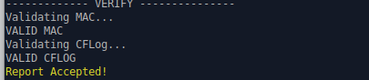
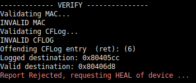

# TRACES: TEE-based Runtime Auditing for Commodity Embedded Systems

## Repository Description
This is the public repository for the prototype of TRACES: TEE-based Runtime Auditing for Commodity Embedded Systems. The [STM32CubeIDE](https://www.st.com/en/development-tools/stm32cubeide.html) is used for development, and TRACES is deployed on an [STM32 Nucleo-144 development board](https://www.st.com/en/evaluation-tools/nucleo-l552ze-q.html#overview) with STM32L552ZE MCU


## Paper Abstract
Control Flow Attestation (CFA) has become a vital technique to combat runtime attacks in low-cost embedded and IoT devices. CFA generates a trace (CFLog) containing the destination of all branching instructions executed. This allows a remote Verifier (Vrf) to inspect the execution control flow on a potentially compromised embedded device a Prover (Prv) – before trusting that a value/action was correctly produced/performed by Prv. While CFA can detect compromises that alter the control flow of Prv’s software, it cannot guarantee the eventual delivery of CFLog containing evidence of the compromise. For instance, a compromised Prv may refuse to send CFLog to prevent Vrf from identifying the exploit’s source and remediating the vulnerability. To address this challenge, we propose TRACES: TEE-based Runtime Auditing for Commodity Embedded Systems. In contrast with CFA, TRACES guarantees that Vrf always receives periodic runtime reports from Prv, even when Prv is compromised. This, in turn, enables secure runtime auditing, in addition to pure attestation. Furthermore, TRACES supports a “remediation” phase that Vrf can trigger upon compromise detection to patch the identified vulnerability and bring the compromised device to a healthy state. To the best of our knowledge, TRACES is the first system to provide this functionality on commodity devices (i.e., without requiring custom hardware modifications). To that end, TRACES leverages support from the ARM TrustZone-M Trusted Execution Environment (TEE). To demonstrate the practicality of this design, we implement and evaluate a fully functional prototype of TRACES atop the commodity ARM Cortex-M33 microcontroller unit.

## Exploit detection Example

### Description
The demo of TRACES includes an application that reads from an input buffer to determine which sensor program to execute (Ultrasonic, Temperature, or both), then parses this input in order to perform the proper actions. However, it contains an intentionally placed vulnerability -- a buffer overflow -- due to reading from the input buffer until a stop character is is encountered. Because of this, an attacker can overwrite the return address that was previously pushed onto the stack and cause arbitrary behavior.

In this application a function `process_command` calls a function `read_command`, and `read_command` contains the buffer overflow vulnerability. Since the return address of `process_command` is pushed onto the stack prior to calling `read_command`, its return address can be overwritten. The expected behavior after `process_command` is to return to `application` which then proceeds to call the proper sensor program. However, the buffer overflow caused by the attack input results in `process_command` returning to itself, essentially looping forever and preventing any sensor program from executing. 

### Results
The `vrf/cflog` directory contains the CFLogs generated by the two scenarios. As seen in `cflogs/attack/0.cflog`, a set of control flow events repeat infinitely despite there being no infinite loop. Whereas in `cflogs/benign/0.cflog`, the initial sequence eventually returns to perform the sensor readings.

## Requirements

1) Install [STM32CubeIDE](https://www.st.com/en/development-tools/stm32cubeide.html) 1.13.1
2) 

## Import and setup STM32 Project

1) First, clone this repository. Then import the files from `./prv/TRACES` into a project.

2) In the Project Explorer, click the drop-down arrow on `TRACES` to reveal `TRACES_NonSecure`. Right click `TRACES_NonSecure` and click "Properties". In the next window, click "C/C++ Build -> Settings -> MCU Post build outputs". Click the checkbox on the option "Generate list file". Then click "Apply and Close". 

3) Repeat step 2 for `TRACES_Secure`.

## Running the demo (quick version)

This section describes the steps to run the exploit detection example. First, setup the prover (Prv) executing on the  STM32L552ZE MCU. Then, setup the Verifier to execute on a Ubuntu machine. Then, run the example to demonstrate detection and remediation.

### Setting up Prv

1) The source code in `vrf/demo-prv-software` contains two ready-to-run versions of the demo application: which only vary based on the simulated input values. 
	`benign.s` simulates receiving a command to execute the ultrasonic sensor.
	`malicious.s` simulates receiving an attack input which causes to inifinitely execute `process_command` in `application.s`

2) Determine which scenario to execute. Then, copy the contents of the `*.s` file into `prv/TRACES/TRACES_NonSecure/Core/Src/application.s`

3) Then, in STM32CubeIDE, right-click `TRACES_NonSecure` and select "Build Project". Repeat for `TRACES_Secure`

### Setting up Vrf

1) Open a terminal window, and `cd` into the `vrf/demo-vrf-source` directory of this repository.

2) First, run the script `readmem.sh`. This script reads from the `.list` files produced while building Prv project to create `Secure.mem` and `NonSecure.mem` files in `objects`. These files are processed by Vrf to verify Prv memory is correct at runtime.

### Running the demo

1) This demo uses a USB-UART connection between Vrf and Prv. Therefore, connect STM32L552ZE MCU board to your machine through a USB cable.

2) In STM32CubeIDE, right-click `TRACES_Secure`. Then click "Run As" followed by "STM32 Cortex M C/C++ Application". Prv is now running and waiting for a request to run the application from Vrf

3) From the Vrf terminal window in `vrf/demo-vrf-source`, run the python script `vrf_communication_module.py`. First, Vrf will execute (hash Prv memory and create a CFG of the application.) Then, the Vrf will be ready to send a request to Prv. In the terminal window, the script output will show new protocol has begun.

4) Press ENTER to send a request from Vrf for Prv to execute the application software. 

5) During execution, Vrf will save CFLogs sent to Prv in the `vrf/cflog` directory.

### Expected results - Benign Scenario

When either `benign.s` is selected, the expected console output is below: 



Verifier will determine that the reported CFLog abides by the CFG, Prv memory is in a valid state, and the MAC is authentic.
 
### Expected results - Attack Scenario

When `malicious.s` is selected, the expected console output is below:



During this execution, the MAC is determined to be valid. But, the contents of the CFLog denote a control-flow attack occurred due to the buffer overflow incurred by the malicious input. Because of TRACES triggers, the attack is identified in the next report received by Vrf.

### Building other Sensor/BEEB applications

1) To build other apps, select the application to run by defining `APP_SEL` on line 19 of `vrf/demo-vrf-source/application.h`.

2) The script `vrf/demo-vrf-source/pre-process.sh` will compile the C code into assembly, instrument the assembly code, and copy the instrumented assembly into the STM32 Project directory. First, modify line 9 of `vrf/demo-vrf-source/pre-process.sh` to point to the root directory of the STM32 project. Then, in `vrf/demo-vrf-source/` directory, run the following console command: `./pre-process.sh application instrument`. This will return two assembly files: `application.s` (containing the unmodified application assembly code)  and `instrument.s` (containing the instrumented version of the assembly code).

3) Then, in STM32CubeIDE, right-click `TRACES_NonSecure` and select "Clean Project". Repeat and select "Build Project" to build the project.

4) Back in the console from `vrf/demo-vrf-source`, run `readmem.sh`. 

5) Then, in STM32CubeIDE, right-click `TRACES_Secure` and select "Build Project". Repeat and select "Build Project" to build the project.

6) In STM32CubeIDE, right-click `TRACES_Secure`. Then click "Run As" followed by "STM32 Cortex M C/C++ Application". Prv is now running and waiting for a request to run the application from Vrf

7) From the Vrf terminal window in `vrf/demo-vrf-source`, run the python script `vrf_communication_module.py`. 

8) Press ENTER to send a request from Vrf for Prv to execute the application software. 

9) During execution, Vrf will save CFLogs sent to Prv in the `vrf/cflog` directory.


# Step-by-Step Guide on Evaluating Attack and Benign Behavior

### 1. Select the Mode (Benign/Malicious)

Navigate to the `Traces/vrf/demo-vrf-source/` directory and run one of the following commands depending on the desired behavior mode:

```bash
# For benign behavior
./updatemem.sh -mode benign

# For malicious behavior
./updatemem.sh -mode malicious
```

### 2. Compile the Code

Open the STM32IDE and compile the code, building both projects.

### 3. Generate the Control Flow Graph and Update Memory Range

While still in the `Traces/vrf/demo-vrf-source/` directory, run the following command to obtain the control flow graph of the binary and update the memory range of the Non-Secure Code:

```bash
./readmem.sh
```

### 4. Recompile the Code

Open the STM32IDE and recompile the code, building both projects.


### 5. Run the application

In STM32CubeIDE, right-click TRACES_Secure. Then click "Run As" followed by "STM32 Cortex M C/C++ Application". Prv is now running and waiting for a request to run the application from Vrf

---

This structure helps clarify each step and makes the instructions easier to follow.