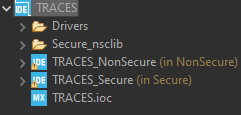
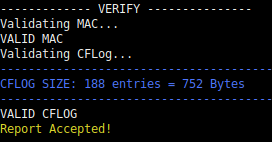
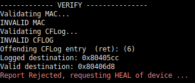
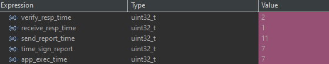

# TRACES: TEE-based Runtime Auditing for Commodity Embedded Systems

Authors : Adam Caulfield¹, Antonio Joia Neto¹, Norrathep Rattanavipanon², Ivan De Oliveira Nunes¹

Rochester Institute of Technology¹,  Prince of Songkla University²


## Repository Description
This is the public repository for the prototype of TRACES: TEE-based Runtime Auditing for Commodity Embedded Systems. The [STM32CubeIDE](https://www.st.com/en/development-tools/stm32cubeide.html) is used for development, and TRACES is deployed on an [STM32 Nucleo-144 development board](https://www.st.com/en/evaluation-tools/nucleo-l552ze-q.html#overview) with STM32L552ZE MCU


## Paper Abstract
Control Flow Attestation (CFA) has become a vital technique to combat runtime attacks in low-cost embedded and IoT devices. CFA generates a trace (CFLog) containing the destination of all branching instructions executed. This allows a remote Verifier (Vrf) to inspect the execution control flow on a potentially compromised embedded device a Prover (Prv) – before trusting that a value/action was correctly produced/performed by Prv. While CFA can detect compromises that alter the control flow of Prv’s software, it cannot guarantee the eventual delivery of CFLog containing evidence of the compromise. For instance, a compromised Prv may refuse to send CFLog to prevent Vrf from identifying the exploit’s source and remediating the vulnerability. To address this challenge, we propose TRACES: TEE-based Runtime Auditing for Commodity Embedded Systems. In contrast with CFA, TRACES guarantees that Vrf always receives periodic runtime reports from Prv, even when Prv is compromised. This, in turn, enables secure runtime auditing, in addition to pure attestation. Furthermore, TRACES supports a “remediation” phase that Vrf can trigger upon compromise detection to patch the identified vulnerability and bring the compromised device to a healthy state. To the best of our knowledge, TRACES is the first system to provide this functionality on commodity devices (i.e., without requiring custom hardware modifications). To that end, TRACES leverages support from the ARM TrustZone-M Trusted Execution Environment (TEE). To demonstrate the practicality of this design, we implement and evaluate a fully functional prototype of TRACES atop the commodity ARM Cortex-M33 microcontroller unit.

## Exploit detection Example

### Description
The demo of TRACES includes an application that reads from an input buffer to determine which sensor program to execute (Ultrasonic, Temperature, or both), then parses this input in order to perform the proper actions. However, it contains an intentionally placed vulnerability -- a buffer overflow -- due to reading from the input buffer until a stop character is is encountered. Because of this, an attacker can overwrite the return address that was previously pushed onto the stack and cause arbitrary behavior.

In this application a function `process_command` calls a function `read_command`, and `read_command` contains the buffer overflow vulnerability. Since the return address of `process_command` is pushed onto the stack prior to calling `read_command`, its return address can be overwritten. The expected behavior after `process_command` is to return to `application` which then proceeds to call the proper sensor program. However, the buffer overflow caused by the attack input results in `process_command` returning to itself, essentially looping forever and preventing any sensor program from executing. 

### Results
The `vrf/cflog` directory contains the CFLogs generated by the two scenarios. As seen in `cflogs/attack/0.cflog`, a set of control flow events repeat infinitely despite there being no infinite loop. Whereas in `cflogs/benign/0.cflog`, the initial sequence eventually returns to perform the sensor readings.

## Requirements

1)  [STM32 Nucleo-144 development board](https://www.st.com/en/evaluation-tools/nucleo-l552ze-q.html#overview) with STM32L552ZE MCU
2) [STM32CubeIDE](https://www.st.com/en/development-tools/stm32cubeide.html) 1.13.1

# Import and setup STM32 Project

1) First, clone [this](https://github.com/RIT-CHAOS-SEC/TRACES) repository. 

2) Open the STM32CubeIDE and then import the files from `./prv/TRACES` into a project.

2) In the Project Explorer, click the drop-down arrow on `TRACES` to reveal `TRACES_NonSecure`. Right click `TRACES_NonSecure` and click "Properties". In the next window, click "C/C++ Build -> Settings -> MCU Post build outputs". Click the checkbox on the option "Generate list file". Then click "Apply and Close". 

3) Repeat step 2 for `TRACES_Secure`.

In the end you should have a project tree like :




# Step-by-Step Guide on Evaluating Attack and Benign Behavior

This steps contains two ready-to-run versions of the demo application: which only vary based on the simulated input values. 
The benign mode simulates an application receiving a command to execute the ultrasonic sensor. The malicious mode simulates receiving an attack input which causes to inifinitely execute. 

## Activating trustzone in the device

To reproduce the code in this repository, follow these steps:

1. Download `STM32CubeProgrammer 1.9.0 v2.10.0` from the official website.

2. Connect the `NUCLEO-L552ZE-Q board` to your computer using a USB port.

3. Open STM32CubeProgrammer and establish a connection with the NUCLEO-L552ZE-Q board.

4. Activate TrustZone by following these steps:
    - Go to the user configuration settings and set the `TZEN` and `DBANK` variables.
    - Navigate to the security areas configuration and set them as below:

### Secure Area 1
NAME | Value 
-|-
SECWM1_PSTRT | Value = 0x0; Address = 0x08000000 
SECWM1_PEND | Value = 0x7f; Address = 0x0803f800

### Secure Area 2
NAME | Value 
-|-
SECWM1_PSTRT | Value = 0x1; Address = 0x08040800 
SECWM1_PEND | Value = 0x0;  Address = 0x08040000


## Setting up the prover code

1) Select the Mode (Benign/Malicious)

Navigate to the `Traces/vrf/demo-vrf-source/` directory and run one of the following commands depending on the desired behavior mode:

```bash
# For benign behavior
./updatemem.sh -mode benign

# For malicious behavior
./updatemem.sh -mode malicious
```

2) Compile the Code

Open the STM32CubeIDE, right-click `TRACES_NonSecure` and select "Build Project". Repeat for `TRACES_Secure`

3) Generate the Control Flow Graph and Update Memory Range

    While still in the `Traces/vrf/demo-vrf-source/` directory, run the following command to obtain the control flow graph of the binary and update the memory range of the Non-Secure Code:

```bash
./readmem.sh
```

4) Recompile the Code

    Open the STM32CubeIDE and recompile the code, building both projects.


## Running the demo

1) This demo uses a USB-UART connection between Vrf and Prv. Therefore, connect STM32L552ZE MCU board to your machine through a USB cable.

2) In STM32CubeIDE, right-click `TRACES_Secure`. Then click "Run As" followed by "STM32 Cortex M C/C++ Application". Prv is now running and waiting for a request to run the application from Vrf

3) From the Vrf terminal window in `vrf/demo-vrf-source`, run the python script `vrf_communication_module.py`. First, Vrf will execute (hash Prv memory and create a CFG of the application.) Then, the Vrf will be ready to send a request to Prv. In the terminal window, the script output will show new protocol has begun.

4) Press ENTER to send a request from Vrf for Prv to execute the application software. 

5) During execution, Vrf will save CFLogs sent to Prv in the `vrf/cflog` directory.

## Expected results - Benign Scenario

When either `benign` is selected, the expected console output is below: 



Verifier will determine that the reported CFLog abides by the CFG, Prv memory is in a valid state, and the MAC is authentic.
 
## Expected results - Attack Scenario

When `malicious` is selected, the expected console output is below:



During this execution, the MAC is determined to be valid. But, the contents of the CFLog denote a control-flow attack occurred due to the buffer overflow incurred by the malicious input. Because of TRACES triggers, the attack is identified in the next report received by Vrf.


# Building other Sensor/BEEB applications

To build the different applications in the evaluation, follow the steps 

1) Select the application

Navigate to the `Traces/vrf/demo-vrf-source/` directory and run one of the following commands depending on the desired behavior mode:

```bash
# List the available apps 
./updatemem.sh -app help

# Select specific app to run
./updatemem.sh -app {AppName}
```

2) Compile the Code

Open the STM32CubeIDE, right-click `TRACES_NonSecure` and select "Build Project". Repeat for `TRACES_Secure`

3) Generate the Control Flow Graph and Update Memory Range

    While still in the `Traces/vrf/demo-vrf-source/` directory, run the following command to obtain the control flow graph of the binary and update the memory range of the Non-Secure Code:

```bash
./readmem.sh
```

4) Recompile the Code

    Open the STM32CubeIDE and recompile the code, building both projects.

5) After it follow the steps from section `Running the demo` above


# Timing Measurements

After selection one of the application and following the steps 1-4 from `Setup the debugging environment`, do

### Setup the debugging environment

1) Open the STM32CubeIDE

2) Click with the right button on the project TRACES_Secure -> Debug as -> Debug Configurations

3) Double Click on STM32 C/C++ Application to create a new debug configuration

4) Open the tab Startup, and add the project TRACES_NonSecure, move the TRACES_Secure up  and then click in apply to close the window and apply the configurations.

### Adding Breakpoints

1) In STM32CubeIDE, open the file `TRACES/prv/TRACES/Secure/Core/Src/cfa_engine.c` 

2) Add a breakpoint in the following line

```
224 	return CONTINUE_LOOP;
```

### Adding expressions

1) On the top of STM32CubeIDE, click on the debug icon in the top of the screen to start the debugging mode 

2) Click in Window->Show Views-> Expressions to open the expressions tab

3) Add the following variables to measure specific times of the application

```bash
receive_resp_time        # Receive response time 
verify_resp_time         # Verify response time
send_report_time         # Send report time
compute_send_report_time # Generate report and send time 
app_exec_time            # App execution time
```

### Running the application

1) On the top of the STM32CubeIDE, click on the icon "reset the chip and restart debug session"

2) Follow the steps in `Running the demo` to start the verifier side

3) Wait until the execution reach the breakpoint


### Results 

1) When the debugger halt the program in the breakpoint you will be able to see the timings in miliseconds



2) The sum of all the values represents the measurements of Figure 5.
